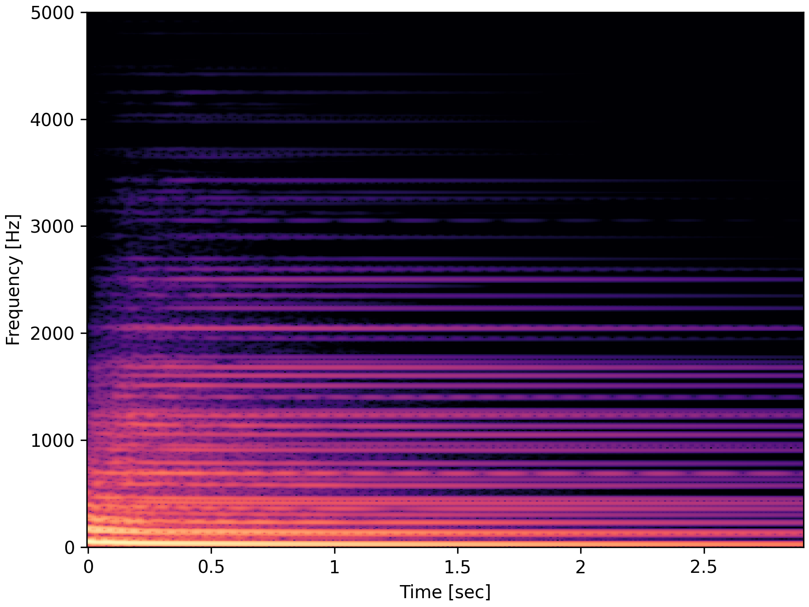
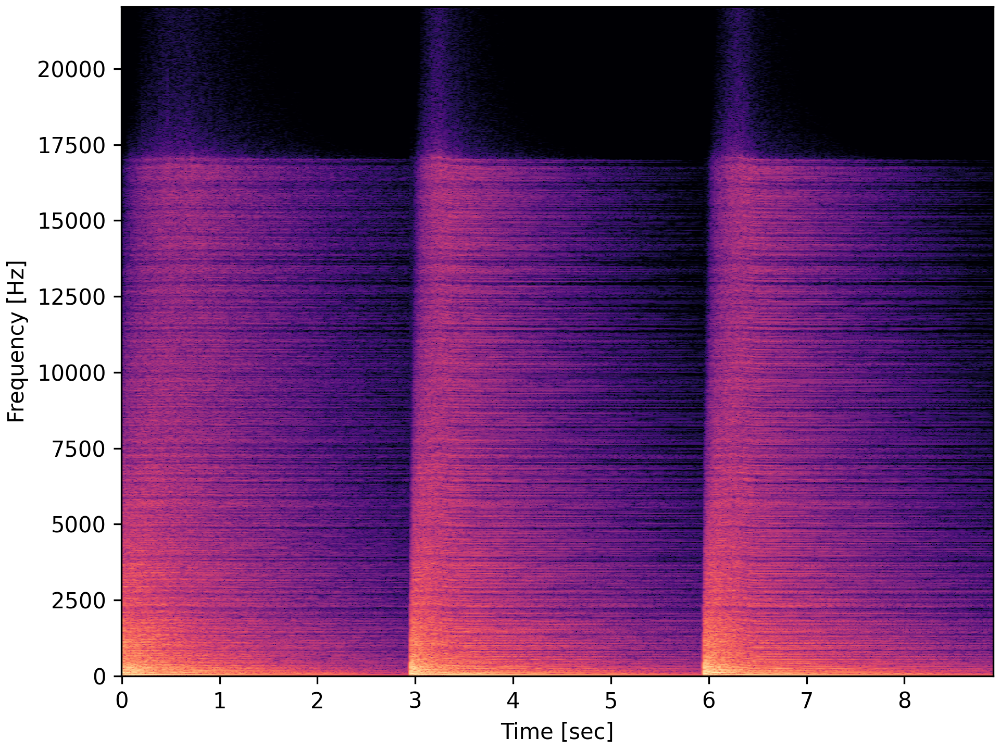
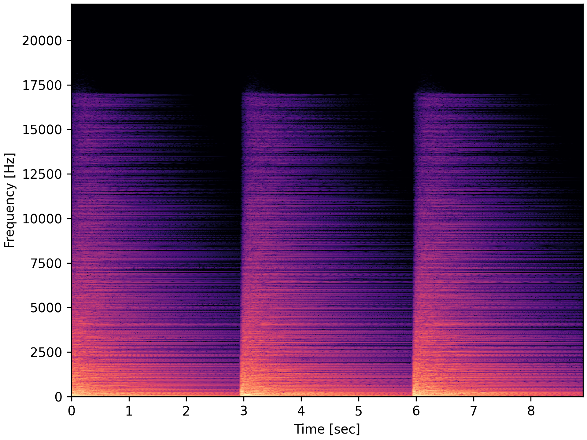

<h2 style="font-size: 1.5em" align="center">
  Explicit and Stable Pseudospectral Time-Domain Method for the Föppl–von Kármán Equations
</h2>

  Victor Zheleznov1 and Stefan Bilbao2

  <i>
    1<a href="https://www.acoustics.ed.ac.uk/" target="_blank" rel="noopener noreferrer">Acoustics and Audio Group</a>, University of Edinburgh, Edinburgh, UK 
    2STMS (UMR9912), IRCAM, CNRS, Sorbonne Université, Paris, France 
  </i>

  Accompanying web-page for the FA2026 paper

  <a href="https://github.com/victorzheleznov/fa2026" class="btn btn--primary btn--small" target="_blank" rel="noopener noreferrer">
    Code
  </a>
  <a href="https://arxiv.org/abs/2608.06139" class="btn btn--primary btn--small" target="_blank" rel="noopener noreferrer">
    arXiv
  </a>

## Abstract

Modal synthesis is a widely-used technique for simulation of musical instrument dynamics. In the linear case, a modal decomposition leads to an uncoupled system of damped and forced harmonic oscillators which can be efficiently solved by standard time-stepping methods. However, extensions to nonlinear problems are challenging due to the presence of products of modal expansions in the governing equations. In the case of the Föppl–von Kármán plate, the nonlinear coupling between the modes is described by a fourth-order tensor and is prohibitively expensive to evaluate in the modal domain. In this work, we propose a pseudospectral method in which the products are evaluated on a grid in the spatial domain while spatial derivatives are computed exactly in the modal domain. Discrete sine and cosine transforms between the modal and spatial domains are used to impose simply supported boundary conditions for the plate. Finally, we prove non-negativity of the nonlinear potential energy of the system and employ a scalar auxiliary variable technique for explicit and stable time integration in the modal domain. As a result, we reduce the computational cost of modal synthesis while preserving its advantages like a precise control over the simulated frequency range. Sound examples are presented.

## Sound Examples

Sound examples for figures in the paper are given, along with additional simulations at the bottom of the page.
All sound examples are normalised and some are illustrated by spectrogram plots.

### For Figure 1

Simulation of a large plate with $\kappa = 8$, initialised in its first mode of vibration.
The transfer of energy to other modes is clearly observed on the spectrogram.

  <audio src="audio/energy.wav" controls></audio>
  
  

    Simulation of the plate, initialised in its first mode of vibration.
  

### For Figure 2

Simulation of a large plate with $\kappa = 8$, repeatedly excited by an external force.
Simulation without drift regulation suffers from wideband noise, inconsistent response to repeated excitation 
and incorrect instantaneous frequencies in "tails" of responses, where the simulation should resemble a linear solution.

  

    <audio src="audio/drift_lambda0_0.wav" controls></audio>
    
    

      Simulation without drift regulation ($\lambda_0 = 0$).
    

  

  

    <audio src="audio/drift_lambda0_1000.wav" controls></audio>
    
    

      Simulation with drift regulation ($\lambda_0 = 10^{3}$).
    

  

### For Figure 3

Simulations of a small plate with $\kappa = 60$ at increasing excitation amplitudes.
Simulation without drift regulation contains audible artefacts, including "fluctuating" instantaneous frequencies.

<table>
<thead>
<tr><th>$f_{\mathrm{amp}}$</th><th>$\lambda_0$</th><th>Output</th></tr>
</thead>
<tbody>
<tr><td>$2 \times 10^{5}$</td><td>$10^{3}$</td><td><audio src="audio/spec_exc_amp_200000_lambda0_1000.wav" controls></audio></td></tr>
<tr><td>$2 \times 10^{6}$</td><td>$10^{3}$</td><td><audio src="audio/spec_exc_amp_2e+06_lambda0_1000.wav" controls></audio></td></tr>
<tr><td>$2 \times 10^{7}$</td><td>$10^{3}$</td><td><audio src="audio/spec_exc_amp_2e+07_lambda0_1000.wav" controls></audio></td></tr>
<tr><td>$2 \times 10^{7}$</td><td>$0$</td><td><audio src="audio/spec_exc_amp_2e+07_lambda0_0.wav" controls></audio></td></tr>
</tbody>
</table>

### Additional Examples

Below are some additional simulations with drift regulation, along with used simulation parameters.

<table>
<thead>
<tr><th>$\kappa$</th><th>$\sigma_0$</th><th>$\sigma_1$</th><th>$\eta$</th><th>$x_{\mathrm{e}}$</th><th>$y_{\mathrm{e}}$</th><th>$x_{\mathrm{o}}$</th><th>$y_{\mathrm{o}}$</th><th>$f_{\mathrm{amp}}$</th><th>$T_{\mathrm{e}}$</th><th>Output</th></tr>
</thead>
<tbody>
<tr><td>$10$</td><td>$1.0$</td><td>$10^{-4}$</td><td>$1.4$</td><td>$0.65$</td><td>$0.46$</td><td>$0.52$</td><td>$0.32$</td><td>$10^{6}$</td><td>$3 \times 10^{-3}$</td><td><audio src="audio/example_kappa_10.wav" controls></audio></td></tr>
<tr><td>$15$</td><td>$1.3$</td><td>$2 \times 10^{-4}$</td><td>$1.2$</td><td>$0.78$</td><td>$0.39$</td><td>$0.98$</td><td>$0.72$</td><td>$2 \times 10^{6}$</td><td>$2 \times 10^{-3}$</td><td><audio src="audio/example_kappa_15.wav" controls></audio></td></tr>
<tr><td>$30$</td><td>$1.5$</td><td>$4 \times 10^{-4}$</td><td>$1.1$</td><td>$0.63$</td><td>$0.62$</td><td>$1.01$</td><td>$0.50$</td><td>$3 \times 10^{6}$</td><td>$3 \times 10^{-3}$</td><td><audio src="audio/example_kappa_30.wav" controls></audio></td></tr>
</tbody>
</table>

